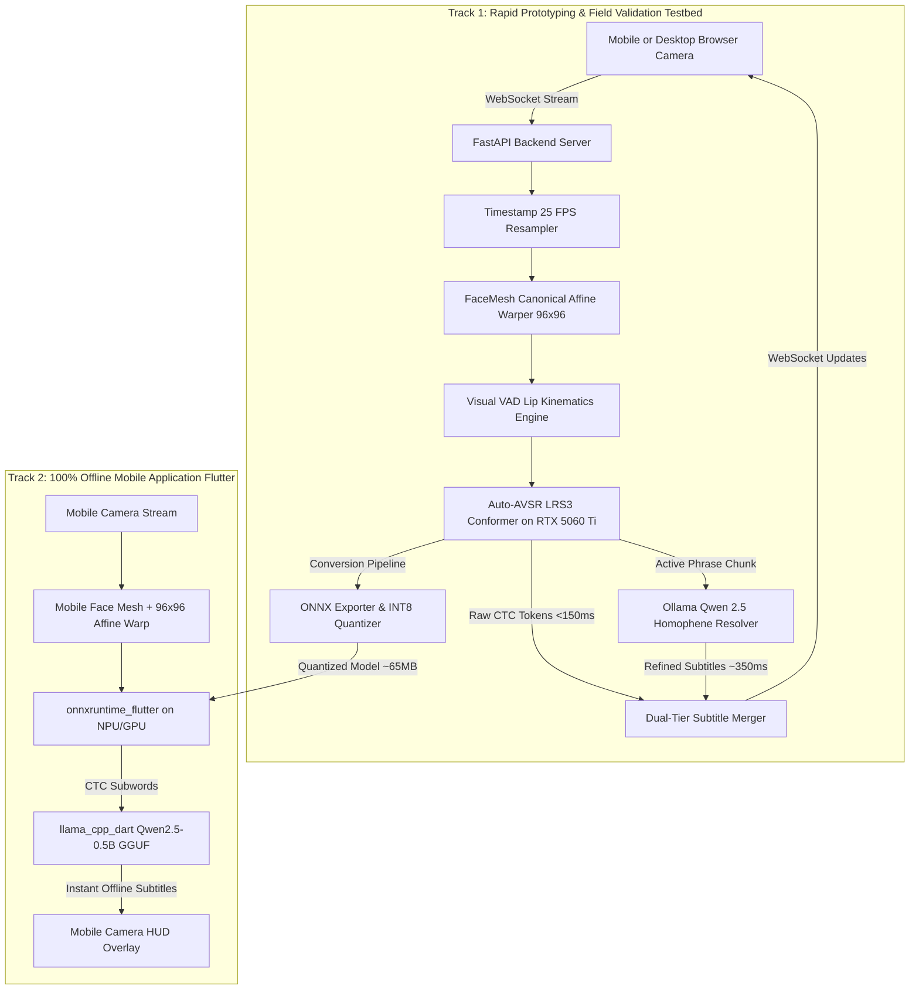

# Design Specification: Offline In-The-Wild Visual Speech Recognition (VSR)

**Date:** 2026-09-27  
**Status:** Approved  
**Author:** Pair Programming Agent & User  
**Target Goal:** In-the-wild, real-time Visual Speech Recognition with on-the-fly subtitles running 100% offline on mobile phone, developed via a dual-track rapid prototyping and mobile export pipeline.

---

## 1. Executive Summary & Problem Context

Visual Speech Recognition (VSR)—lip reading without audio—faces two fundamental real-world bottlenecks:
1. **The Homophene Problem:** Human phonemes are not visually one-to-one with visemes. Bilabials (`/p/`, `/b/`, `/m/`), alveolars (`/t/`, `/d/`, `/n/`), and labiodentals (`/f/`, `/v/`) produce virtually identical lip kinematics. Closed-set models trained on toy datasets like GRID (e.g. LipNet's *"bin blue at f2 now"*) collapse in the wild.
2. **Environmental In-The-Wild Distortions:** Unconstrained phone camera usage suffers from variable frame rates (jittering around 30 FPS instead of the model's expected 25.0 FPS), head pose angles (yaw, pitch, roll), varying lighting, and subtle camera shake.

To achieve **real-time in-the-wild lip reading completely offline on a mobile phone**, this project uses:
* **Visual Speech Backbone:** Auto-AVSR (`mpc001/auto_avsr`) with the `LRS3_V_WER19.1` PyTorch checkpoint (3D ResNet-18 front-end + 12-layer Conformer encoder trained on 400+ hours of TED talks).
* **Vision Preprocessing:** Real-time 25.0 FPS timestamp resampler + MediaPipe Face Mesh + Canonical 2D Affine Warping to normalize multi-angle faces into a standardized 96×96 grayscale mouth tensor.
* **Language Prior / Homophene Resolver:** An SLM (Qwen 2.5 3B/7B via Ollama during prototyping, and Qwen 2.5 0.5B/1.5B Q4_K_M GGUF via `llama.cpp` on mobile) to correct homophenes, grammar, and casing without hallucinating.
* **Architecture:** A Dual-Track Monorepo transitioning from a rapid Python/FastAPI testbed on an RTX 5060 Ti into an INT8/FP16 quantized ONNX model inside a standalone offline Flutter mobile application.

---

## 2. System Architecture



### 2.1 Repository Layout

```text
visual-speech-recognition/
├── backend/                  # Track 1: FastAPI headless VSR & Ollama server
│   ├── app.py                # WebSocket (/ws/stream) and REST (/api/recognize-clip)
│   ├── vsr_engine.py         # 1.5s sliding-window Auto-AVSR inference engine
│   ├── face_tracker.py       # Face Mesh landmark tracking & canonical affine warping
│   ├── resampler.py          # Strict 25.0 FPS millisecond timestamp-based resampler
│   ├── vad.py                # Visual Voice Activity Detection (LAR & motion delta)
│   ├── llm_resolver.py       # Async Ollama client with homophene prompt engineering
│   └── configs/              # Auto-AVSR LRS3 model configuration files (.ini)
├── export/                   # Model conversion & optimization pipeline
│   ├── export_onnx.py        # PyTorch -> ONNX with dynamic temporal sequence axis
│   └── quantize.py           # INT8 / FP16 dynamic & static quantization scripts
├── frontend_web/             # Track 1 Testbed Web Client (Mobile & Desktop PWA)
│   ├── index.html            # Viewfinder, face guide reticle, live subtitle boxes
│   ├── app.js                # WebSocket full-duplex client & audio/video capture
│   └── style.css             # High-contrast dark mode HUD
├── mobile/                   # Track 2: Standalone Offline Flutter Application
│   ├── lib/
│   │   ├── camera/           # Native camera frame stream & format converters
│   │   ├── vision/           # MLKit FaceMesh + 96x96 affine warp engine
│   │   ├── vsr/              # onnxruntime_flutter VSR execution provider
│   │   ├── llm/              # llama_cpp_dart on-device GGUF SLM manager
│   │   └── ui/               # Camera HUD, reticle, and subtitle rendering
│   └── pubspec.yaml
└── models/                   # Auto-AVSR checkpoints, ONNX models, and GGUF SLMs
```

---

## 3. Vision Preprocessing & Multi-Angle Normalization

### 3.1 Strict 25.0 FPS Resampling
Auto-AVSR's Conformer encoder was trained specifically on 25.0 FPS video. Mobile cameras typically stream at 30 FPS, 60 FPS, or variable FPS under varying exposure.
* Each incoming video frame is tagged with its capture timestamp $t$.
* The resampler maintains a monotonic timeline at 40ms intervals ($t_k = k \times 40\text{ms}$).
* Frames are selected using timestamp proximity: $f_k = \arg\min_i |t_{frame, i} - t_k|$. If latency allows, linear frame blending is applied between adjacent frames.

### 3.2 Canonical 2D Affine Warping (Multi-Angle In-The-Wild Normalization)
To support faces turned up to ±45° yaw/pitch:
1. Detect 468 3D landmarks via MediaPipe Face Mesh.
2. Extract critical anchor points:
   * Left mouth corner: landmark `#61`
   * Right mouth corner: landmark `#291`
   * Upper lip center: landmark `#0`
   * Lower lip center: landmark `#17`
   * Left eye center: `#33`, Right eye center: `#263` (used for head roll calculation)
3. Compute an affine transformation matrix $M$ aligning the detected mouth landmarks to a predefined canonical frontal template:
   $$\begin{bmatrix} x' \\ y' \end{bmatrix} = M \begin{bmatrix} x \\ y \\ 1 \end{bmatrix}$$
4. Warp and crop the frame into a standardized **96×96 grayscale ROI**. This geometrically centers and straightens the lips regardless of whether the speaker is turned or tilting their head.
5. Apply an Exponential Moving Average (EMA, $\alpha = 0.7$) across landmarks between consecutive frames to eliminate tracking jitter.

### 3.3 Visual Voice Activity Detection (V-VAD)
To eliminate hallucinated subwords during speech pauses:
* **Lip Aspect Ratio (LAR):**
  $$\text{LAR} = \frac{||\mathbf{p}_{\text{upper}} - \mathbf{p}_{\text{lower}}||}{||\mathbf{p}_{\text{left}} - \mathbf{p}_{\text{right}}||}$$
* **Pixel Kinematic Delta:**
  $$\Delta I_t = \frac{1}{96 \times 96} \sum_{x,y} |I_t(x,y) - I_{t-1}(x,y)|$$
* Speech is marked active when $\text{LAR} > \theta_{\text{LAR}}$ or $\Delta I_t > \theta_{\text{motion}}$. When silent for $>400\text{ms}$, a phrase closure is triggered.

---

## 4. VSR Inference Engine & Sliding-Window Streaming

### 4.1 Auto-AVSR Conformer Model
* **Front-end:** 3D Convolution layer (`5x7x7`, stride `1x2x2`) + 2D ResNet-18 feature extractor generating 512-dim visual embeddings per frame.
* **Backbone:** 12-layer Conformer encoder with 4 attention heads, feed-forward dimension 2048, and depthwise separable convolution kernel size 31.
* **Decoder:** CTC greedy / prefix beam search decoder with a 1024-token SentencePiece unigram vocabulary.

### 4.2 On-The-Fly Sliding-Window Logic
* **Window Duration:** 1.5 seconds (37 frames at 25 FPS).
* **Step Size:** 0.5 seconds (12 frames).
* **Token Merger:** Overlapping CTC subwords are stitched using longest common prefix matching. Confirmed words are permanently committed, while tentative trailing subwords are dynamically updated when the subsequent 500ms chunk arrives.
* **Target Latency:**
  * Desktop (RTX 5060 Ti): ~100–150ms per window.
  * Mobile Phone (ONNX NPU/GPU): ~200–350ms per window.

---

## 5. Language Prior / Homophene Resolver

### 5.1 Desktop Prototyping (Ollama)
* **Model:** `qwen2.5:3b` or `qwen2.5:7b` via local Ollama (`http://localhost:11434`).
* **Prompt Specification:**
  ```text
  System: You are an expert phonetic language reconstructor for Visual Speech Recognition.
  The input text is derived solely from lip-reading and contains errors:
  1. Homophenous substitutions (e.g., p/b/m, t/d/n, f/v, k/g).
  2. Missing unstressed particles (e.g., "to", "the", "a").
  Your goal: Reconstruct the exact spoken English sentence.
  Constraints:
  - Do NOT invent new facts or concepts.
  - Return ONLY the corrected natural sentence in proper case and punctuation.
  - If input is gibberish or empty, return empty string.
  ```

### 5.2 Standalone Offline Mobile SLM (`llama.cpp` + GGUF)
* **Runtime:** `llama_cpp_dart` embedding `llama.cpp` into Flutter via Dart FFI.
* **Model:** `Qwen2.5-0.5B-Instruct-Q4_K_M.gguf` (~350MB RAM, 45–80 tokens/sec on mobile CPU/NPU) or `Qwen2.5-1.5B-Instruct-Q4_K_M.gguf` (~900MB RAM, 25–45 tokens/sec).
* **Context Limit:** Context window capped at 128 tokens; KV-cache footprint < 15MB.

---

## 6. Model Export & Mobile Optimization

1. **PyTorch to ONNX (`export/export_onnx.py`):**
   * Export inputs: `input_tensor = (1, 1, T, 96, 96)` with dynamic axis for time $T$.
   * Replace non-standard PyTorch ops with standard ONNX Opset 17+ primitives.
2. **Quantization (`export/quantize.py`):**
   * **FP16 Export:** For mobile GPU backends (Metal on iOS, Vulkan on Android).
   * **INT8 Quantization:** Using ONNX Runtime quantization with calibration data, reducing the model from ~230MB to **~65MB** for mobile NPUs.
3. **Parity Check:** Numerical parity script verifying that the ONNX model output matches PyTorch within $\epsilon < 10^{-3}$ on benchmark LRS3 video samples.

---

## 7. Phased Implementation Roadmap

### Phase 1: Rapid Prototyping & Field Validation (Python Desktop + LAN Web Testbed)
* **Step 1.1: Environment & Weights Setup:** `uv` virtual environment (Python 3.11), PyTorch with CUDA for RTX 5060 Ti, Auto-AVSR `LRS3_V_WER19.1` weights & configs.
* **Step 1.2: Vision Preprocessing Core:** 25 FPS resampler, MediaPipe Face Mesh, canonical affine 96×96 warper, and Visual VAD.
* **Step 1.3: VSR Inference Engine:** Headless Auto-AVSR pipeline with 1.5s sliding window and CTC token stitching.
* **Step 1.4: Ollama Resolver:** Async Ollama client with homophene prompt engineering.
* **Step 1.5: FastAPI Server:** WebSocket `/ws/stream` and REST endpoints with local LAN / HTTPS support for phone browsers.
* **Step 1.6: Web Client PWA:** Viewfinder, front/rear camera toggle, face alignment reticle, and two-tier live subtitle HUD.
* **Step 1.7: Field Validation:** Live testing on desktop webcam and phone camera across angles (0°–45°) and lighting conditions.

### Phase 2: Model Export & Mobile Optimization
* **Step 2.1: ONNX Export:** Script converting PyTorch model to ONNX with dynamic temporal axis.
* **Step 2.2: INT8/FP16 Quantization:** Benchmark quantized models for speed and parity.
* **Step 2.3: Mobile SLM Packaging:** Download and prepare Qwen2.5-0.5B/1.5B GGUF weights.

### Phase 3: Standalone 100% Offline Mobile App (Flutter)
* **Step 3.1: Flutter Project Setup:** Project creation with `onnxruntime_flutter` and `llama_cpp_dart`.
* **Step 3.2: Mobile Vision Engine:** Camera frame streaming, MLKit FaceMesh, and 96×96 affine warp.
* **Step 3.3: On-Device Pipelines:** Wiring ONNX Runtime VSR model and `llama.cpp` SLM.
* **Step 3.4: Subtitle HUD & Optimization:** Floating camera HUD overlay running 100% offline.
